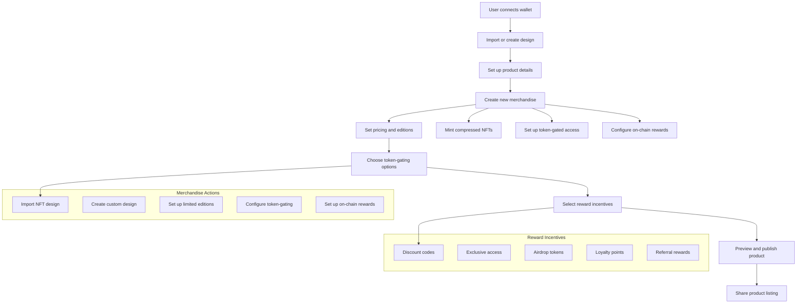

Turn Your Ideas Into Custom Products, Sell Globally

<h3>

 | [Website](https://www.coinswag.com/) | [Demo Video](https://www.loom.com/share/f41bea255e3d4069b4860d143e40f8fd)

</h3>

Here's a significantly shortened version:

NFT artists and memecoin communities struggle to create merch shops due to high costs and technical barriers. Coinswag solves this by offering a Web3-native social commerce platform that enables:

1. Easy creation of custom merch from NFTs and ideas
2. Instant shop setup with no upfront costs
3. Global sales with both crypto and fiat payments

Key features include on-demand production, native crypto payments, and easy design tools. Our waitlist has already attracted over 100 signups, demonstrating strong market interest.

Coinswag is revolutionizing how Web3 communities engage fans and monetize their brand through physical merchandise.

## 📖 Protocol Architecture

## 🛠 Workflow
1) User logs in to their Coinswag account.
2) Access the dashboard to view store stats (profit, orders, recent sales).
3) Create new merch by uploading logo/design and setting details.
4) Choose from various merch types (hoodies, t-shirts, mugs, etc.).
5) Manage orders and view customer information.
6) Share merch listings as "blinks" for Twitter promotion.
7) Customers can browse, customize (size, color), and purchase merch.
8) Checkout process includes shipping details and payment via [Mercuryo](https://mercuryo.com).

## 🪛 Integration

[Metaplex DAS API](https://docs.metaplex.com/programs/token-metadata/overview) – Used to fetch and interact with digital asset data on the Solana blockchain.

[Metaplex Bubblegum](https://docs.metaplex.com/programs/compression/overview) - Utilized for creating and managing compressed NFTs representing physical merchandise.

[Mercuryo](https://mercuryo.io/) - Integrated for seamless crypto and fiat payment processing during checkout.

[Arweave](https://www.arweave.org/) - Used for permanent storage of product metadata and designs.

## 🌐 Repo URLs
- [Coinswag Frontend](https://github.com/coinswag/frontend)
- [Coinswag Backend](https://github.com/coinswag/backend)